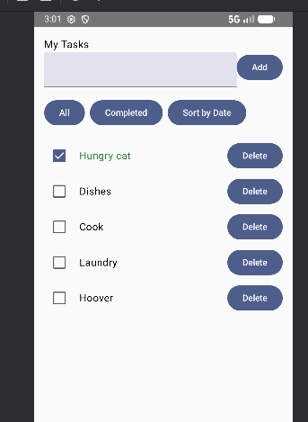

# Mobile Programming with Native Technologies

## Week 2 assignment

### Overview

This week’s assignment expands the Week 1 project by introducing ViewModel-based state management. The app now uses Jetpack Compose with reactive state updates so the UI automatically updates when tasks are added, removed, toggled, or filtered.

### Features

* Task list displayed with **LazyColumn**
* **ViewModel** (TaskViewModel) manages tasks with a master list
* **Add tasks** using a TextField + Add button
* **Toggle task completion** using a checkbox (task title turns dark green when done)
* **Delete tasks** with a Delete button
* **Filter and sort buttons:**
    * Show all tasks
    * Show only completed tasks
    * Sort by due date

### Optional Features

* Task title color changes to dark green when a task is marked as done — makes completed tasks visually distinct
* Filter and sort buttons improve UI clarity

### Structure

* **Domain Layer:** Task model and mock data (MyTask)
* **ViewModel: TaskViewModel** holds the state (tasks) and functions for add, remove, toggle, filter, and sort
* **UI Layer:**
    * HomeScreen shows the list and buttons
    * MainActivity launches the HomeScreen

### Why use ViewModel instead of remember
* remember only keeps state while a Composable is in memory. If the Composable is destroyed (e.g., on screen rotation), the data is lost.
* ViewModel lives as long as the Activity and survives configuration changes like rotations
* Using ViewModel the task list stays consistent, and all UI updates happen automatically through reactive state

### APK

Debug APK available in the [Week 2 Release](https://github.com/YvonneFrankort/Mobile-Programming/releases/tag/week2)  
Or download the APK directly: [app-debug.apk](https://github.com/YvonneFrankort/Mobile-Programming/releases/download/week2/app-debug.apk)

### Demo video

A short video to demonstrate the code and app on an emulator:
[Week 2 Release](https://github.com/YvonneFrankort/Mobile-Programming/releases/tag/week2)  
[Watch video](https://github.com/YvonneFrankort/Mobile-Programming/releases/download/week2/video_week2.mp4)

### Screenshot

